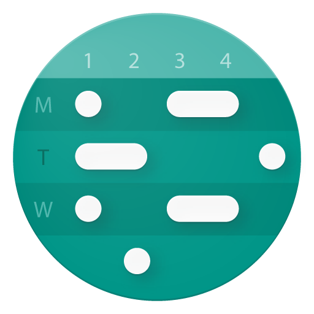
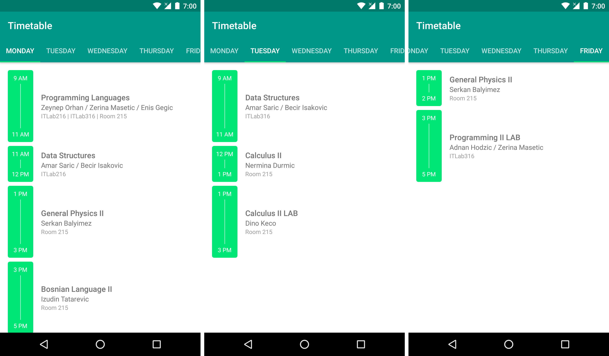

<p align="center">

</p>

<h3><p align="center">Timetable</p></h3>

<p align="center"><i>A super simple timetable app</i></p>



<p align="right">
<a href='https://github.com/xiprox/Timetable/releases/latest'></a>
</p>

## What is this?
This is a very simple timetable app I crafted for my personal use. It works with JSON data stored in the assets folder.

## Can I use it too?
Yes. However, you will have to fork the project, change the data, and rebuild the app. You can either update the [JSON file](https://github.com/xiprox/Timetable/blob/master/app/src/main/assets/timetable.json) directly or create a copy of [this](https://docs.google.com/spreadsheets/d/1LStBwnFAdI6i9WK33_AZ0QXDIASUvgBCzDIgKDlHl3Q) spreadsheet and then convert the data to JSON (you can use [Mr. Data Converter](https://shancarter.github.io/mr-data-converter)).

## License
```
Copyright (C) 2017  İhsan Işık

This program is free software: you can redistribute it and/or modify
it under the terms of the GNU General Public License as published by
the Free Software Foundation, either version 3 of the License, or
(at your option) any later version.

This program is distributed in the hope that it will be useful,
but WITHOUT ANY WARRANTY; without even the implied warranty of
MERCHANTABILITY or FITNESS FOR A PARTICULAR PURPOSE.  See the
GNU General Public License for more details.
```
GPL v3 ([LICENSE](/LICENSE))
